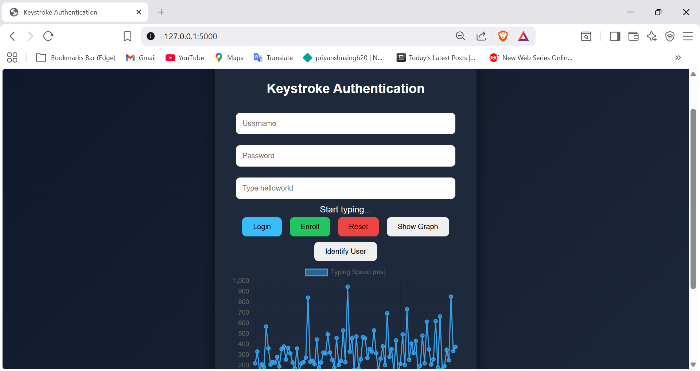

# Keystroke Authentication System

This project uses typing patterns (keystroke dynamics) for user authentication.

## Features
- Password authentication
- Behavioral biometric verification
- Machine learning user identification
- Real-time typing analysis

## Tech Stack
- Python (Flask)
- Scikit-learn
- PyTorch
- JavaScript (Chart.js)

## Run
pip install -r requirements.txt  
python app.py

